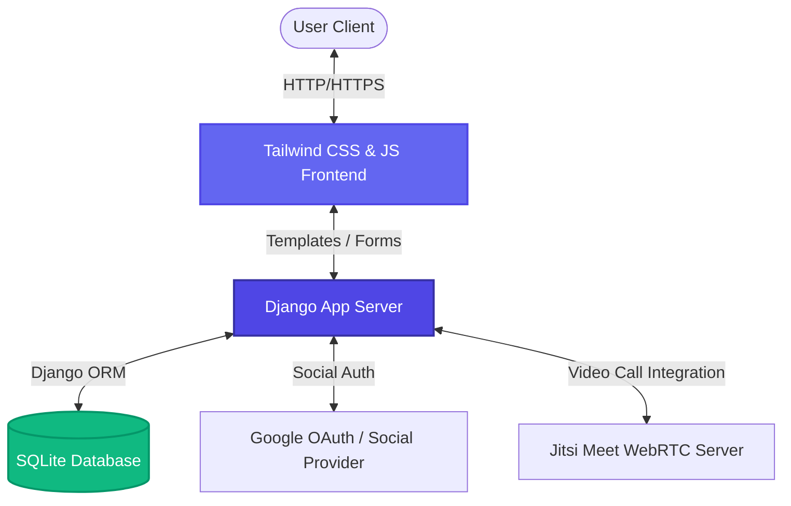
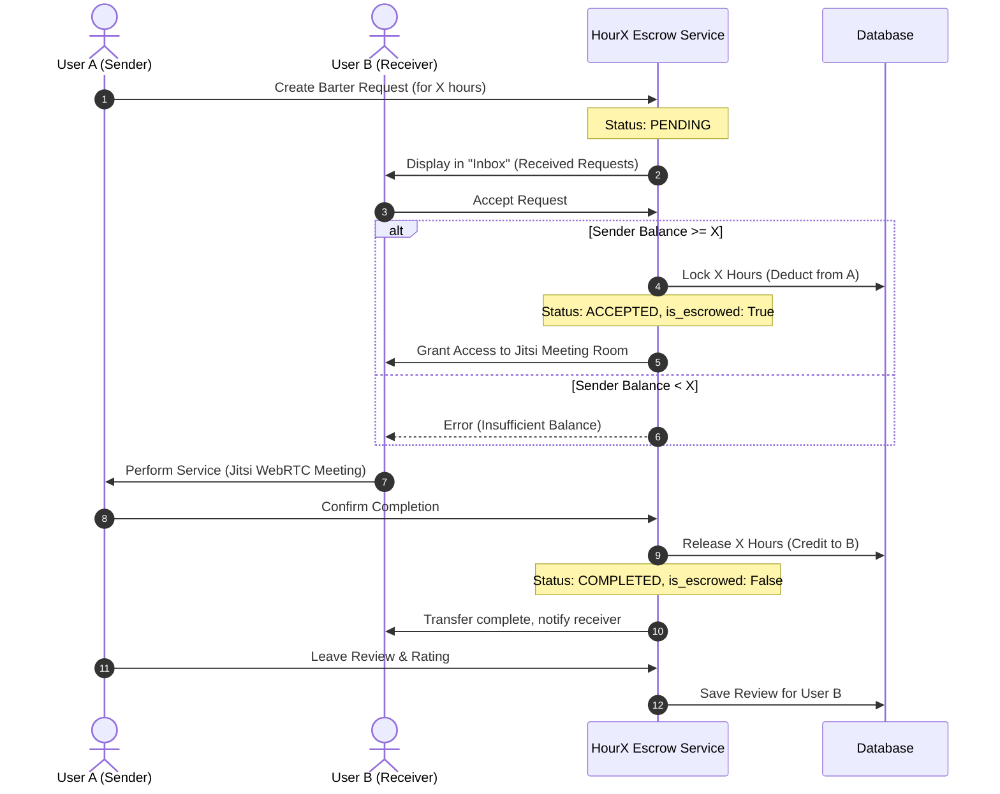

<!-- PROJECT BANNER -->
<p align="center">
  
</p>

# ⏳ HourX — Premium Time Bartering Platform

> **HourX** is a modern, decentralized peer-to-peer time bartering platform that allows users to exchange services and skills without money. Instead, it utilizes **Time Credits** (hours) as a trustless medium of exchange, secured by an intelligent local escrow protocol and integrated with live video-meeting capabilities.

---

## ✨ Features

- 🌌 **Premium UI/UX**: Designed with a high-end glassmorphic theme, custom gradients, interactive card layouts, glowing micro-animations, and full mobile responsiveness.
- 💳 **Escrow-Based Barter System**: A bulletproof peer-to-peer transaction protocol. When a request is accepted, hours are locked in escrow and released only upon successful completion, preventing fraud.
- 💬 **Integrated Meetings**: Generate private Jitsi Meet videoconferencing rooms dynamically inside the dashboard for active barters.
- 🛡️ **Advanced Authentication**: Built-in OAuth integration (Google, GitHub, Discord, LinkedIn) and custom email/password reset flows utilizing 6-digit OTP codes.
- 👥 **Reputation & Review Loop**: Review and rate users (1-5 stars) upon barter completion to foster community trust.
- 📊 **Dynamic Dashboard**: Beautiful gradient-accented statistics panel showing available time balance, active barters, and listed skills.

---

## 🛠️ Tech Stack

- **Backend**: Python 3, Django Web Framework (using Class-based & Functional Views)
- **Frontend**: HTML5, Vanilla JavaScript, Tailwind CSS (with custom utility classes & design tokens)
- **Database**: SQLite (local dev database, ready for Postgres migration)
- **Authentication**: Django Allauth (Social OAuth configuration)
- **Video Conferencing**: Jitsi Meet WebRTC Integration

---

## 🗺️ System Architecture

### Component Interaction Diagram



### Escrow & Service Delivery Workflow

The time-credit transaction follows a strict escrow cycle to guarantee fairness:



---

## 📂 Project Structure

```bash
hourx/
│
├── hourx/                      # Main Settings & Configuration
│   ├── settings.py             # Configured for Allauth, custom user model & static paths
│   └── urls.py                 # Core routing engine
│
├── accounts/                   # Authentication & Profiles App
│   ├── management/commands/    # setup_social_apps.py (OAuth helper command)
│   ├── models.py               # Custom User model (time_balance, reset_otp)
│   └── views.py                # Dashboard, Profile, and OTP password-reset logic
│
├── skills/                     # Skill Listings App
│   ├── models.py               # Skill model categorized by Dev, Design, Writing, Music
│   └── views.py                # Skill CRUD logic
│
├── barter/                     # Peer-to-Peer Barter & Escrow App
│   ├── services.py             # Escrow engine (lock_escrow, release_escrow, cancel_request)
│   └── views.py                # Request management, Inbox, Jitsi Meeting controller
│
├── reviews/                    # Reputation System App
│   ├── models.py               # Rating (1-5 stars) and comments
│   └── views.py                # Review submission view
│
├── static/                     # Global Assets
│   ├── css/                    # Custom Tailwind bundles and responsive design rules
│   └── images/                 # Banner artwork & media files
│
└── templates/                  # Glassmorphism Page Templates
```

---

## 🚀 Setup & Installation

### Prerequisites
- Python 3.10+ installed
- Git installed

### 1. Clone & Set Up Environment
```bash
# Clone the repository
git clone https://github.com/Tusarkanta-07/hourx.git
cd hourx

# Create a virtual environment
python -m venv venv

# Activate the virtual environment
# On Windows:
venv\Scripts\activate
# On Linux/macOS:
source venv/bin/activate

# Install dependencies
pip install -r requirements.txt
```

### 2. Run Database Migrations
Create and run database migrations to build your local SQLite schema:
```bash
python manage.py makemigrations
python manage.py migrate
```

### 3. Configure OAuth Providers (Optional)
HourX includes a custom Django management command to easily configure social authentication clients for Google, Github, LinkedIn, or Discord.
```bash
python manage.py setup_social_apps <provider> <client_id> <secret_key>

# Example:
python manage.py setup_social_apps google "YOUR_GOOGLE_CLIENT_ID" "YOUR_GOOGLE_SECRET_KEY"
```

### 4. Run the Development Server
Create a superuser to access the Django admin panel and start the local development server:
```bash
# Create admin user
python manage.py createsuperuser

# Start development server
python manage.py runserver
```
Navigate to `http://127.0.0.1:8000/` in your browser.

---

## 🔒 Security & Best Practices

- **Escrow Transactions**: Built with atomic database transactions (`transaction.atomic`) to ensure no race conditions, preventing double-spending of time credits.
- **CSRF Protection**: All forms are fully protected using Django's CSRF token system.
- **Clean Environment**: Custom `.gitignore` excludes `db.sqlite3`, `__pycache__/`, `staticfiles/`, and local media directories to maintain a clean codebase.

---

## 📄 License
This project is open-source. For more information, please check the terms and privacy guidelines files in the repo.
