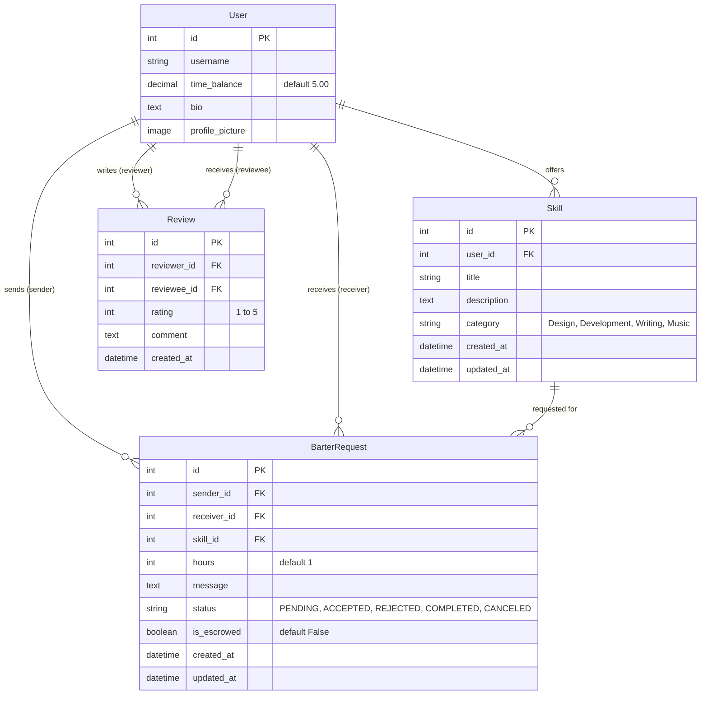
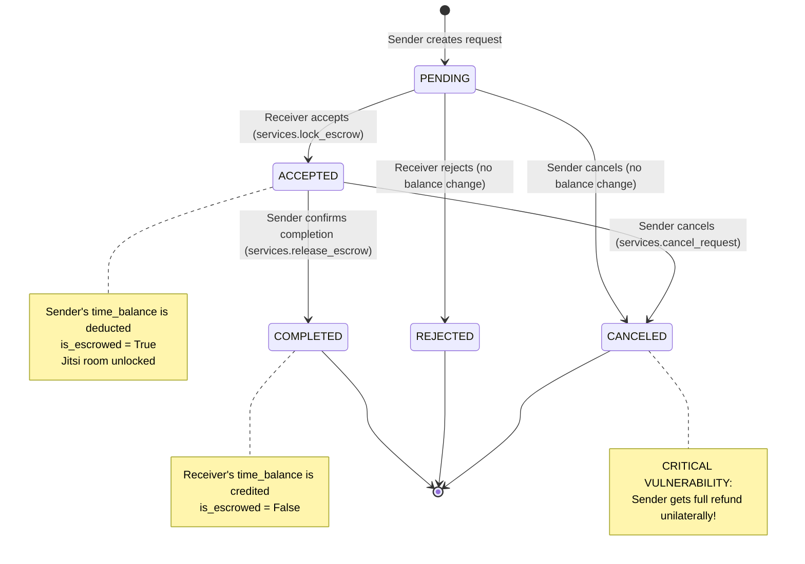

# ⏳ HourX — Comprehensive Project Analysis & Technical Audit Report

**Date**: September 10, 2026  
**Project**: HourX (Peer-to-Peer Time Bartering Platform)  
**Repository**: [hourx](file:///d:/antigravity%20projects/first/hourx)  
**Tech Stack**: Python 3.14, Django 6.0.1, SQLite, Django-Allauth, Vanilla CSS ("Celestial Noir"), Jitsi Meet WebRTC  

---

## 1. Executive Summary

**HourX** is a decentralized peer-to-peer time-credit bartering marketplace built on Django 6.0. Users exchange their skills (Development, Design, Writing, Music) without fiat currency using **Time Credits** (hours) as a medium of exchange. The platform incorporates a local escrow system to hold hours during an active transaction, an embedded Jitsi Meet videoconferencing interface for real-time collaboration, a reputation review system, and a dark glassmorphic design language dubbed the "Celestial Noir Design System".

The architecture prioritizes a frictionless user experience with third-party social authentication (Google, GitHub, Discord, LinkedIn) and instant onboarding. Our audit identified key areas for enhancement, primarily centered on **escrow transaction security**, **balance concurrency controls**, and **reputation integrity**.

---

## 2. Architecture & Codebase Map

### 2.1 Directory Breakdown

```
hourx/
├── accounts/               # Custom user model, dashboard, profile, social auth adapters
├── barter/                 # Barter transaction lifecycle, escrow engine, Jitsi meet integration
├── skills/                 # Skill listings, marketplace browsing, skill CRUD
├── reviews/                # 1-to-5 star rating & feedback loop
├── hourx/                  # Core Django project config (settings, URLs, WSGI, ASGI)
├── static/
│   ├── css/                # style.css (active), responsive design rules
│   └── images/             # Visual banners & branding
├── templates/              # Django HTML templates (Celestial Noir theme)
├── media/                  # User uploads (profile pictures)
├── deployment_guide.md     # Deployment runbook for PythonAnywhere
├── requirements.txt        # Python dependencies
└── manage.py               # Django CLI management entrypoint
```

### 2.2 Core Dependency Analysis

From [`requirements.txt`](file:///d:/antigravity%20projects/first/hourx/requirements.txt):
* **`Django==6.0.1`**: Core framework utilizing modern Python 3.10+ async/sync capabilities.
* **`Pillow`**: Handles profile picture image processing.
* **`django-allauth`**: Manages OAuth2 authentication providers (Google, GitHub, Discord, LinkedIn).
* **`requests-oauthlib`**: Underlying HTTP OAuth transport for allauth.

---

## 3. Data Models & Entity Relationships

The schema is divided across four key applications:



### Key Observations on Models:
1. **Initial Credit Provision**: A post-signup signal in [`accounts/models.py`](file:///d:/antigravity%20projects/first/hourx/accounts/models.py#L27-L32) (`give_initial_credits`) guarantees that newly registered users receive 5.00 hours of initial credits immediately upon sign-in.
2. **Review Decoupling**: The [`Review`](file:///d:/antigravity%20projects/first/hourx/reviews/models.py#L5-L14) model is linked directly between `reviewer` and `reviewee`, but **lacks a foreign key to `BarterRequest`**. This prevents the system from verifying that a review corresponds to a distinct transaction.

---

## 4. Escrow Engine & State Machine

The transaction protocol operates in [`barter/services.py`](file:///d:/antigravity%20projects/first/hourx/barter/services.py). Below is the state transition lifecycle:



---

## 5. Critical Vulnerabilities & Architectural Flaws

### ✅ 1. Unilateral Sender Cancellation Exploit (RESOLVED)
* **Location**: [`barter/services.py`](file:///d:/antigravity%20projects/first/hourx/barter/services.py) & [`barter/views.py`](file:///d:/antigravity%20projects/first/hourx/barter/views.py)
* **Issue**: Previously, in `cancel_request()`, when a request was in `ACCEPTED` state, the sender could unilaterally cancel at any time and get an immediate refund without receiver consent.
* **Resolution**: 
  - Unilateral cancellation by the sender on `ACCEPTED` requests is blocked and raises a `ValidationError`.
  - Added mutual confirmation and receiver consent protocol:
    - Sender can submit a cancellation request with optional reason (`services.request_cancellation`).
    - Receiver must approve/consent (`services.confirm_cancellation`) to finalize cancellation and refund escrow.
    - Receiver (provider) can also voluntarily cancel and release refund to sender directly.
    - Either party can withdraw or decline a cancellation request (`services.withdraw_cancellation`).
    - Sender balance row is safely locked with `select_for_update()`.
  - UI updated across sent requests, received requests, dashboard, and legal/support documentation.

---

### 🚨 2. Balance Concurrency & Race Condition on Escrow Lock (Medium-High Severity)
* **Location**: [`barter/services.py`](file:///d:/antigravity%20projects/first/hourx/barter/services.py#L9-L26)
* **Issue**:
  ```python
  with transaction.atomic():
      barter_request = BarterRequest.objects.select_for_update().get(id=request_id)
      sender = barter_request.sender
      if sender.time_balance < barter_request.hours:
          raise ValidationError(...)
      sender.time_balance -= barter_request.hours
      sender.save()
  ```
  `BarterRequest` is locked via `select_for_update()`, but **`sender` is not locked**. If a user with 5 hours has two pending requests accepted simultaneously by two different providers, both worker processes read `sender.time_balance = 5`, pass the check, deduct 5, and result in a negative balance or lost updates.
* **Remediation**: Lock the user row directly:
  ```python
  sender = User.objects.select_for_update().get(id=barter_request.sender_id)
  ```

---

### ⚠️ 3. Unconstrained Review Duplication & Lack of Transaction Binding (Medium Severity)
* **Location**: [`reviews/views.py`](file:///d:/antigravity%20projects/first/hourx/reviews/views.py#L20-L28)
* **Issue**: The view checks `has_completed_txn = BarterRequest.objects.filter(... status='COMPLETED').exists()`. Once two users have completed a single barter transaction, either user can repeatedly call `POST /reviews/add/<user_id>/` and create an unlimited number of 5-star (or 1-star) reviews, artificially manipulating reputation scores.
* **Remediation**:
  1. Add `barter_request = models.OneToOneField(BarterRequest, on_delete=models.CASCADE, related_name='review')` to the `Review` model.
  2. Enforce that each barter request can only be reviewed once.

---

### ⚠️ 4. Insecure Public Jitsi Meeting Rooms (Low-Medium Severity)
* **Location**: [`barter/views.py`](file:///d:/antigravity%20projects/first/hourx/barter/views.py#L121-L122) and [`templates/barter/meeting.html`](file:///d:/antigravity%20projects/first/hourx/templates/barter/meeting.html)
* **Issue**: Meeting rooms are generated using:
  ```python
  meeting_room_name = f"HOURX_Meeting_{request_id}_{clean_title}_SecureRoom"
  ```
  This room name is completely predictable. It connects to the public `meet.jit.si` cluster without room passwords, JWT tokens, or moderation locks. Any external party who knows the URL can join the room.
* **Remediation**: Generate a cryptographically secure random token (e.g., `uuid.uuid4()`) for the room name.

---

### ⚠️ 5. Configuration & Code Quality
* **Hardcoded Domain**: [`accounts/management/commands/setup_social_apps.py`](file:///d:/antigravity%20projects/first/hourx/accounts/management/commands/setup_social_apps.py#L24) hardcodes `domain = 'testpythontusar.pythonanywhere.com'`. This should accept an argument or read from `ALLOWED_HOSTS`.
* **Missing Pagination**: [`skills/views.py`](file:///d:/antigravity%20projects/first/hourx/skills/views.py#L14) loads all skills into memory at once (`Skill.objects.all()`).
* **Non-Functional UI Filter**: The "Minimum Rating" star component on the marketplace sidebar ([`templates/skills/list.html`](file:///d:/antigravity%20projects/first/hourx/templates/skills/list.html#L39-L48)) is static markup without form inputs or view filtering.

---

## 6. Test Suite & Verification Analysis

* **Test Suite**: Run with `py -3 manage.py test`.
* **Current Result**: 6 tests passed.
* **Test Coverage**:
  * [`barter/tests.py`](file:///d:/antigravity%20projects/first/hourx/barter/tests.py): Covers `lock_escrow`, `lock_escrow_insufficient_funds`, `release_escrow`, `reject_request`, `cancel_pending_request`, `cancel_accepted_request`.
  * `accounts/tests.py`: Empty file (0 tests).
  * `skills/tests.py`: Empty file (0 tests).
  * `reviews/tests.py`: Empty file (0 tests).
* **Overall Test Coverage**: < 20% of codebase.

---

## 7. Prioritized Remediation Roadmap

| Priority | Category | Action Item | Estimated Effort |
| :--- | :--- | :--- | :--- |
| **Resolved** | Code Hygiene | **Clean Dead Assets & Allauth Fix**: Removed `tailwind.css`, `main.css`, `classlist.txt` and resolved Allauth `account.W001` (committed & pushed). | Completed |
| **Resolved** | Security / Logic | **Fix Escrow Cancellation**: Prevent unilateral cancellation once request is `ACCEPTED`. Require receiver consent or mutual confirmation. | Completed |
| **P0 (Critical)** | Concurrency | **Fix Row-Level Lock**: Lock `User` model with `select_for_update()` in `lock_escrow()`. | 30 mins |
| **P1 (High)** | Data Integrity | **Bind Reviews to Transactions**: Add `OneToOneField(BarterRequest)` on `Review` model to stop rating spam. | 1-2 hours |
| **P1 (High)** | Video Security | **Secure Jitsi Rooms**: Replace deterministic room names with UUIDv4 tokens. | 30 mins |
| **P2 (Medium)** | Scalability | **Marketplace Pagination**: Add `Paginator` in `skill_list` view and implement real rating filtering. | 1-2 hours |
| **P3 (Low)** | Testing | **Expand Test Coverage**: Add unit tests for `accounts`, `skills`, and `reviews` views. | 3-4 hours |

---

## 8. Conclusion

HourX is a thoughtfully conceived and visually compelling application. Its core escrow architecture and UI theme ("Celestial Noir") demonstrate substantial effort and strong aesthetic execution. By addressing the critical escrow cancellation vulnerability, adding balance row-locking, and binding reviews directly to barter transactions, HourX will be a robust, secure, and production-ready time-exchange platform.
