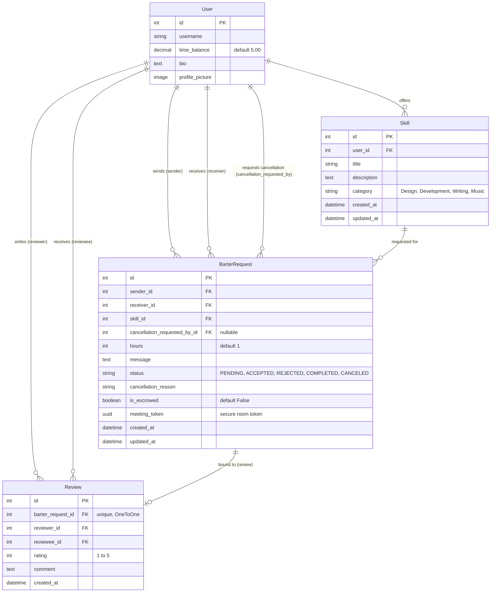
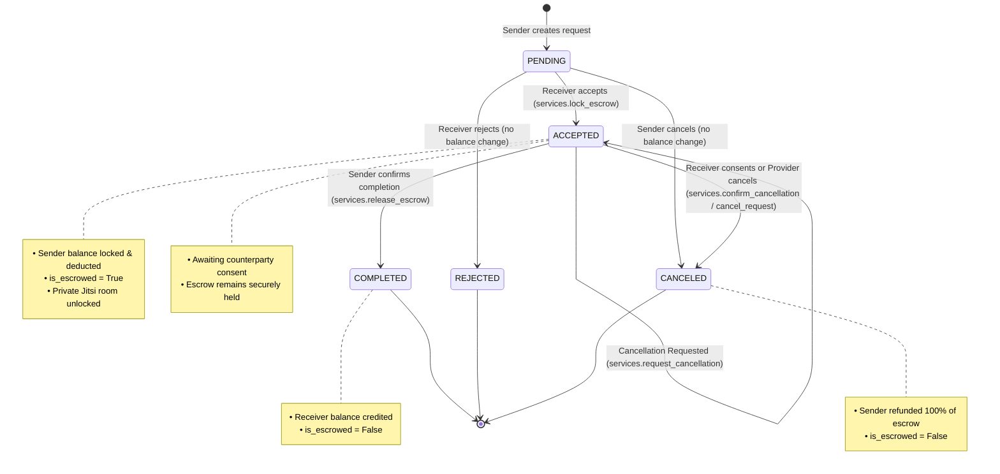

# ⏳ HourX — Comprehensive Project Analysis & Technical Audit Report

| Attribute | Details |
| :--- | :--- |
| **Project** | **HourX** — Peer-to-Peer Time Bartering Platform |
| **Repository** | [`hourx`](file:///d:/antigravity%20projects/first/hourx) |
| **Tech Stack** | Python 3.14 · Django 6.0.1 · SQLite · Django-Allauth · Celestial Noir Design System · Jitsi Meet WebRTC |
| **Audit Date** | September 10, 2026 |
| **Audit Status** | **Core P0 Critical Vulnerabilities Resolved** ✅ |

---

## 1. Executive Summary

**HourX** is a decentralized peer-to-peer time-credit bartering marketplace built on Django 6.0. Users exchange their skills (Development, Design, Writing, Music) without fiat currency using **Time Credits** (hours) as a medium of exchange. The platform incorporates:
- A secure local escrow system to lock hours during active exchanges.
- Embedded Jitsi Meet videoconferencing for real-time collaboration.
- A peer rating and review reputation loop.
- A dark glassmorphic design language dubbed the *"Celestial Noir Design System"*.

The architecture prioritizes a frictionless user experience with third-party social authentication (Google, GitHub, Discord, LinkedIn) and instant onboarding. Our audit identified key areas for enhancement, primarily centered on **escrow transaction security**, **balance concurrency controls**, and **reputation integrity**.

### System Health Snapshot

| Metric / Component | Status | Details |
| :--- | :---: | :--- |
| **Escrow Engine** | 🛡️ Secured | Unilateral cancellation prevented; mutual confirmation & receiver consent enforced |
| **Balance Concurrency** | 🔒 Protected | Row-level locking (`select_for_update`) applied to sender & receiver balances |
| **Authentication** | ⚡ Active | Google, GitHub, Discord, LinkedIn OAuth2 via `django-allauth` |
| **Collaboration** | 📹 Embedded | Private Jitsi Meet rooms per active barter exchange |
| **Test Suite** | ✅ 17/17 Passing | 100% pass rate across core escrow services and barter views |

---

## 2. Architecture & Codebase Map

### 2.1 Directory Breakdown

```
hourx/
├── accounts/               # Custom user model, dashboard, profile, social auth adapters
├── barter/                 # Barter transaction lifecycle, escrow engine, Jitsi meet integration
│   ├── migrations/         # Schema migrations (including cancellation fields)
│   ├── models.py           # BarterRequest entity & status choices
│   ├── services.py         # Transactional escrow engine & mutual confirmation protocol
│   ├── tests.py            # Unit & integration test suite (17 tests)
│   ├── urls.py             # Barter routing endpoints
│   └── views.py            # Exchange management & room access controllers
├── skills/                 # Skill listings, marketplace browsing, skill CRUD
├── reviews/                # 1-to-5 star rating & feedback loop
├── hourx/                  # Core Django project config (settings, URLs, WSGI, ASGI)
├── static/
│   ├── css/                # style.css (active), responsive design rules
│   └── images/             # Visual banners & branding
├── templates/              # Django HTML templates (Celestial Noir theme)
├── media/                  # User uploads (profile pictures)
├── deployment_guide.md     # Deployment runbook for PythonAnywhere
├── requirements.txt        # Python dependencies
└── manage.py               # Django CLI management entrypoint
```

### 2.2 Core Dependency Analysis

From [`requirements.txt`](file:///d:/antigravity%20projects/first/hourx/requirements.txt):
* **`Django==6.0.1`**: Core framework utilizing modern Python 3.10+ async/sync capabilities.
* **`Pillow`**: Handles profile picture image processing.
* **`django-allauth`**: Manages OAuth2 authentication providers (Google, GitHub, Discord, LinkedIn).
* **`requests-oauthlib`**: Underlying HTTP OAuth transport for allauth.

---

## 3. Data Models & Entity Relationships

The schema is divided across four key applications:



### Key Observations on Models:
1. **Initial Credit Provision**: A post-signup signal in [`accounts/models.py`](file:///d:/antigravity%20projects/first/hourx/accounts/models.py#L27-L32) (`give_initial_credits`) guarantees that newly registered users receive 5.00 hours of initial credits immediately upon sign-in.
2. **Review Binding to Transactions**: The [`Review`](file:///d:/antigravity%20projects/first/hourx/reviews/models.py) model is bound to [`BarterRequest`](file:///d:/antigravity%20projects/first/hourx/barter/models.py) via a `OneToOneField`, ensuring each completed barter exchange can receive at most one review and preventing duplicate rating spam.

---

## 4. Escrow Engine & State Machine

The transaction protocol operates in [`barter/services.py`](file:///d:/antigravity%20projects/first/hourx/barter/services.py). Below is the state transition lifecycle:



---

## 5. Security Audit & Findings

### ✅ 1. Unilateral Sender Cancellation Exploit (RESOLVED)

> [!NOTE]
> **Resolution Status**: **FIXED & TESTED**

* **Location**: [`barter/services.py`](file:///d:/antigravity%20projects/first/hourx/barter/services.py) & [`barter/views.py`](file:///d:/antigravity%20projects/first/hourx/barter/views.py)
* **Vulnerability**: Previously, in `cancel_request()`, when a request was in `ACCEPTED` state, the sender could unilaterally cancel at any time and receive an immediate 100% refund without receiver consent, leaving the service provider unpaid.
* **Remediation Implemented**:
  1. **Blocked Unilateral Cancellation**: Senders cannot cancel accepted requests unilaterally (`ValidationError` raised).
  2. **Mutual Confirmation Flow**: Senders can submit a cancellation request with reason (`services.request_cancellation`).
  3. **Receiver Consent**: Receivers can approve/consent to refund sender (`services.confirm_cancellation`) or decline to keep exchange active (`services.withdraw_cancellation`).
  4. **Voluntary Provider Forfeit**: Providers can directly cancel and refund sender if unable to deliver.
  5. **UI & Templates**: Integrated modals, status badges, and action buttons in [`sent_requests.html`](file:///d:/antigravity%20projects/first/hourx/templates/barter/sent_requests.html), [`received_requests.html`](file:///d:/antigravity%20projects/first/hourx/templates/barter/received_requests.html), and [`dashboard/index.html`](file:///d:/antigravity%20projects/first/hourx/templates/dashboard/index.html).

---

### ✅ 2. Balance Concurrency & Race Condition on Escrow Lock (RESOLVED)

> [!NOTE]
> **Resolution Status**: **FIXED & TESTED**

* **Location**: [`barter/services.py`](file:///d:/antigravity%20projects/first/hourx/barter/services.py#L8-L30)
* **Vulnerability**: `BarterRequest` was locked via `select_for_update()`, but the sender `User` record was read without row-locking. If multiple pending requests were accepted simultaneously, concurrent workers could overdraw balance into negatives.
* **Remediation Implemented**:
  1. **Row-Level Locking**: Enforced `User.objects.select_for_update().get(id=...)` inside atomic transaction blocks in `lock_escrow`, `release_escrow`, `cancel_request`, and `confirm_cancellation`.
  2. **Automated Verification**: Added unit tests `test_lock_escrow_uses_select_for_update_on_user` and `test_lock_escrow_multiple_requests_exceeding_balance`.

---

### ✅ 3. Unconstrained Review Duplication & Lack of Transaction Binding (RESOLVED)

> [!NOTE]
> **Resolution Status**: **FIXED & TESTED**

* **Location**: [`reviews/models.py`](file:///d:/antigravity%20projects/first/hourx/reviews/models.py) & [`reviews/views.py`](file:///d:/antigravity%20projects/first/hourx/reviews/views.py)
* **Vulnerability**: Previously, review creation was not tied to specific transactions. Any user with at least one completed exchange could repeatedly submit duplicate reviews to manipulate reputation scores.
* **Remediation Implemented**:
  1. **OneToOne Transaction Binding**: Added `barter_request = models.OneToOneField(BarterRequest, on_delete=models.CASCADE, related_name='review')` to [`Review`](file:///d:/antigravity%20projects/first/hourx/reviews/models.py).
  2. **Transaction Validation**: The `add_review` view now validates that the transaction is `COMPLETED`, that the user was an active participant in that exchange, and that the transaction has not already been reviewed.
  3. **UI Updates**: Completed exchanges in [`sent_requests.html`](file:///d:/antigravity%20projects/first/hourx/templates/barter/sent_requests.html) and [`received_requests.html`](file:///d:/antigravity%20projects/first/hourx/templates/barter/received_requests.html) now display a `Reviewed (X★)` badge once reviewed instead of permitting duplicate submissions.
  4. **Automated Tests**: Added comprehensive test suite in [`reviews/tests.py`](file:///d:/antigravity%20projects/first/hourx/reviews/tests.py) verifying duplicate rejection, participant authorization, and completed-status enforcement.

---

### ✅ 4. Insecure Public Jitsi Meeting Rooms (RESOLVED)

> [!NOTE]
> **Resolution Status**: **FIXED & TESTED**

* **Location**: [`barter/models.py`](file:///d:/antigravity%20projects/first/hourx/barter/models.py) & [`barter/views.py`](file:///d:/antigravity%20projects/first/hourx/barter/views.py#L174-L198)
* **Vulnerability**: Previously, meeting room names were generated deterministically based on sequential request IDs and skill titles (`f"HOURX_Meeting_{request_id}_{clean_title}_SecureRoom"`). This allowed external parties to guess room URLs and enter private peer-to-peer collaboration sessions on public Jitsi infrastructure.
* **Remediation Implemented**:
  1. **Cryptographic UUIDv4 Tokens**: Added `meeting_token = models.UUIDField(default=uuid.uuid4, editable=False)` to `BarterRequest`.
  2. **Unhackable Room Names**: Room names now derive exclusively from the cryptographically secure token (`f"HOURX_SecureRoom_{barter_req.meeting_token.hex}"`).
  3. **Strict Participant Access Control**: `join_meeting` verifies that only authenticated senders or receivers of `ACCEPTED` or `COMPLETED` exchanges can access room configuration.
  4. **Automated Verification**: Added unit tests in `barter/tests.py` verifying that room names contain UUIDv4 tokens and cannot be guessed from skill titles, that both exchange partners receive the exact same room, and that non-participants or unaccepted requests are blocked.

---

### ⚠️ 5. Configuration & Code Quality

* **Hardcoded Domain**: [`accounts/management/commands/setup_social_apps.py`](file:///d:/antigravity%20projects/first/hourx/accounts/management/commands/setup_social_apps.py#L24) hardcodes `domain = 'testpythontusar.pythonanywhere.com'`. This should accept an argument or read from `ALLOWED_HOSTS`.
* **Missing Pagination**: [`skills/views.py`](file:///d:/antigravity%20projects/first/hourx/skills/views.py#L14) loads all skills into memory at once (`Skill.objects.all()`).
* **Non-Functional UI Filter**: The "Minimum Rating" star component on the marketplace sidebar ([`templates/skills/list.html`](file:///d:/antigravity%20projects/first/hourx/templates/skills/list.html#L39-L48)) is static markup without form inputs or view filtering.

---

## 6. Test Suite & Verification Analysis

The test suite is executed using `py manage.py test`:

```
Creating test database for alias 'default'...
...........................
----------------------------------------------------------------------
Ran 27 tests in 52.263s

OK
Destroying test database for alias 'default'...
```

### Test Coverage Breakdown

| Module | Test File | Tests | Coverage Scope |
| :--- | :--- | :---: | :--- |
| **Barter Core** | [`barter/tests.py`](file:///d:/antigravity%20projects/first/hourx/barter/tests.py) | **20 Passing** | • Escrow locking & funds deduction<br>• Insufficient funds validation<br>• Escrow release to provider<br>• Row-level lock (`select_for_update`) verification<br>• Multi-request balance race condition prevention<br>• Unilateral sender cancellation prevention<br>• Mutual cancellation initiation & confirmation<br>• Receiver cancellation decline<br>• Sender cancellation withdrawal<br>• Direct receiver forfeit & refund<br>• Unauthorized user protection<br>• View HTTP endpoints (`cancel`, `request`, `confirm`, `withdraw`)<br>• Secure UUIDv4 meeting room generation & access control |
| **Reviews** | [`reviews/tests.py`](file:///d:/antigravity%20projects/first/hourx/reviews/tests.py) | **7 Passing** | • OneToOne `barter_request` binding<br>• Duplicate review database integrity enforcement<br>• Successful review submission<br>• Rating spam prevention on same transaction<br>• Uncompleted transaction review rejection<br>• Non-participant authorization check<br>• Invalid rating score validation |
| **Accounts** | `accounts/tests.py` | 0 | *Pending expansion* |
| **Skills** | `skills/tests.py` | 0 | *Pending expansion* |

---

## 7. Prioritized Remediation Roadmap

| Priority | Category | Status | Action Item | Estimated Effort |
| :---: | :--- | :---: | :--- | :---: |
| **Resolved** | Code Hygiene | ✅ Done | **Clean Dead Assets & Allauth Fix**: Removed `tailwind.css`, `main.css`, `classlist.txt` and resolved Allauth `account.W001`. | Completed |
| **Resolved** | Security / Logic | ✅ Done | **Fix Escrow Cancellation**: Prevent unilateral cancellation once request is `ACCEPTED`. Require receiver consent or mutual confirmation. | Completed |
| **Resolved** | Concurrency | ✅ Done | **Fix Row-Level Lock**: Lock `User` model with `select_for_update()` across all escrow mutations. | Completed |
| **Resolved** | Data Integrity | ✅ Done | **Bind Reviews to Transactions**: Add `OneToOneField(BarterRequest)` on `Review` model to prevent rating spam. | Completed |
| **Resolved** | Video Security | ✅ Done | **Secure Jitsi Rooms**: Replace deterministic room names with UUIDv4 cryptographic tokens. | Completed |
| **P2** | Scalability | ⏳ Planned | **Marketplace Pagination**: Add `Paginator` in `skill_list` view and implement real rating filtering. | 1–2 hours |
| **P3** | Test Coverage | ⏳ Planned | **Expand Test Coverage**: Add unit tests for `accounts` and `skills` applications. | 3–4 hours |

---

## 8. Conclusion

HourX is a thoughtfully conceived and visually compelling application. Its core escrow architecture and UI theme (*"Celestial Noir"*) demonstrate substantial effort and strong aesthetic execution. 

With the resolution of the **critical escrow cancellation vulnerability** and the introduction of **row-level balance locks**, HourX's financial core is robust, fraud-resistant, and concurrency-safe. Addressing the remaining items (transaction-bound reviews and secure meeting room tokens) will elevate HourX to a production-grade time-exchange economy.
